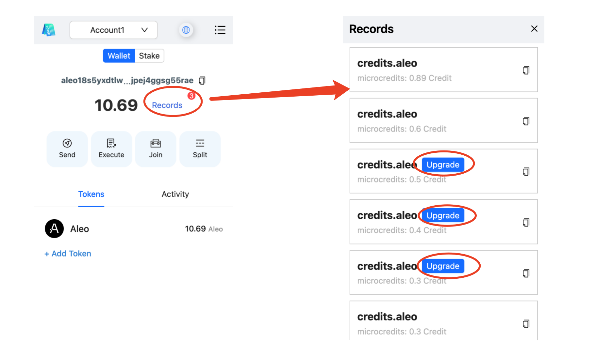
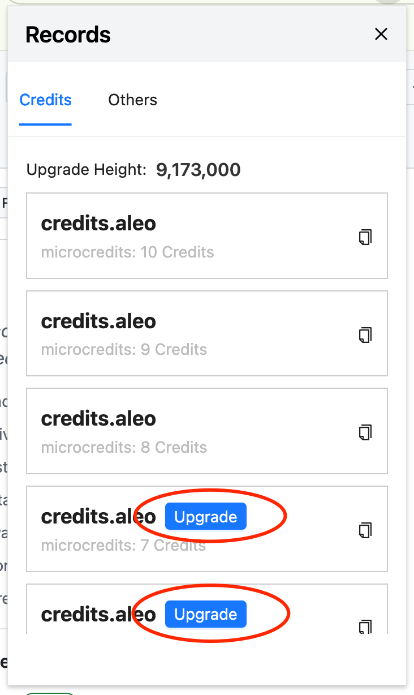

# soter_wallet_release

## Introduction

### Use Upgrade Features
The Record Upgrade feature is used to ensure that existing privacy tokens remain functional after the blockchain height reaches 9,173,000.

Click the 'Upgrade' button to proceed with the upgrade.

## Download

### Mainnet
The mainnet upgrade is tentatively scheduled at block height: 9,425,000. The Soter Wallet development team will promptly provide the upgrade feature once available.
### Testnet
**Wallet**

Provide the Record Upgrade feature. After the blockchain height reaches 9,173,000, existing privacy tokens must undergo Record Upgrade to remain functional.

Version(1.1.1): https://pub-20427a9446664274a7b4b27e6411c226.r2.dev/wallet/aleo-wallet-testnet-1.1.1.zip

**ACC**

- Linux: https://pub-20427a9446664274a7b4b27e6411c226.r2.dev/wallet/aleo-acc-service_1.2.0_amd64.deb
- Windows: https://pub-20427a9446664274a7b4b27e6411c226.r2.dev/wallet/aleo-acc-service_1.2.0_x64-setup.exe
- Macos: https://pub-20427a9446664274a7b4b27e6411c226.r2.dev/wallet/aleo-acc-service_1.2.0_universal.dmg
